# 基于多源特征工程与稳健融合的加密货币市场预测模型研究

## 摘要

加密货币市场短期收益预测具有信号弱、噪声高、特征维度高和分布不稳定等特点。本文以 Kaggle DRW Crypto Market Prediction 任务为研究对象，基于 DRW 提供的生产特征数据预测加密货币未来短期价格变动相关目标，官方评价指标为预测值与真实标签之间的 Pearson correlation。原始训练集包含 525886 行样本、785 个数值特征和目标列 `label`，测试集包含 538150 行样本。由于特征高度匿名且存在明显冗余，本文构建了一套从线性基线、特征筛选、稳健验证、结构化特征工程到低权重非线性信号融合的完整建模流程。

实验首先验证了 Ridge 等线性模型在高维金融特征上的强基线作用，并通过 Pearson top-k 和 Spearman top-k 筛选获得稳定提升。随后，本文引入 correlation medoid、SHAP-stable XGBoost、symbolic interaction features、supervised AutoEncoder 和 supervised MLP 等多类互补信号，并通过小权重融合缓解单一模型在 public/private 分布差异下的过拟合风险。最终模型采用多阶段 ensemble 结构；开发阶段日志中该冻结 Beta7 文件记录 private `0.10550`，赛后复核同一最终文件得到 public `0.06547`、private `0.11043`。由于复核提交发生在比赛结束后，本文不声称官方排名；按整理的最终榜单分数静态插入，其 private 分数约落在第 6 位、public 分数约落在第 514 位。实验表明，该任务的关键不在于盲目增加模型复杂度，而在于对高维匿名特征进行稳定筛选、构造可转移的新信号，并在 public/private 偏差下采取保守融合策略。

**关键词**：加密货币预测；Pearson correlation；Ridge 回归；特征工程；模型融合；稳健验证

---

## 1. 问题背景与任务定义

### 1.1 金融短期预测的建模困难

金融市场短期收益预测通常属于弱信号预测问题。与图像、文本等任务相比，市场数据中的目标信号往往被大量噪声覆盖，且特征与标签之间的关系可能随时间变化而漂移。加密货币市场具有交易活跃、波动剧烈、结构快速变化等特点，因此模型不仅需要在训练样本上获得较高相关性，还必须具备对隐藏测试分布的泛化能力。

本任务中的大部分特征为匿名变量，除 `bid_qty`、`ask_qty`、`buy_qty`、`sell_qty`、`volume` 等少数可命名市场特征外，其余特征以 `X1-X780` 的形式给出。这意味着建模过程中无法依赖明确的业务语义解释每个特征，而必须更多依靠统计相关性、特征冗余结构、时间稳定性和模型输出行为进行判断。

此外，Kaggle 比赛通常包含 public leaderboard 和 private leaderboard。public 分数只基于测试集的一部分，private 分数基于隐藏测试集的另一部分。若模型过度追逐 public 分数，可能出现 public 提升而 private 下降的情况。因此，本文特别关注模型在不同验证口径下的稳定性，并将 public/private divergence 作为模型分析的重要部分。

### 1.2 任务目标与评价指标

本任务的目标是对测试集中每个样本生成一个连续预测值 `prediction`，使其与隐藏真实标签 `label` 的 Pearson correlation 尽可能高。该目标与 Kaggle 官方 overview 中“预测加密货币未来短期价格变动”的任务描述一致 [[1]](#ref-1)。

Pearson correlation 的定义为：

$$
\rho(y, \hat{y}) =
\frac{
\sum_{i=1}^{n}(y_i-\bar{y})(\hat{y}_i-\bar{\hat{y}})
}{
\sqrt{\sum_{i=1}^{n}(y_i-\bar{y})^2}
\sqrt{\sum_{i=1}^{n}(\hat{y}_i-\bar{\hat{y}})^2}
}
$$

其中，$y_i$ 表示真实标签，$\hat{y}_i$ 表示模型预测值，$\bar{y}$ 和 $\bar{\hat{y}}$ 分别表示真实值和预测值均值。

与 RMSE 不同，Pearson correlation 更关注预测值与真实值之间的线性相关方向，而不直接惩罚预测值的绝对尺度偏差。这一特点对模型选择产生了重要影响：部分模型在 RMSE 或本地 holdout 上表现较好，但并不一定能在 leaderboard 上获得更高 Pearson 分数。因此，本文在实验中同时记录 holdout Pearson、RMSE、public 分数和 private 分数，并重点分析它们之间的不一致。

### 1.3 项目简介与技术路线

本项目以官方预测任务为主任务，并围绕该任务补充三个扩展分析问题。主任务关注如何构建可提交的短期收益预测模型；扩展任务 1 从输入端分析高维匿名特征的冗余结构和降维筛选效果；扩展任务 2 从验证端分析模型在不同 row-order time segment 上的稳定性和 public/private 分歧；扩展任务 3 从输出端解释最终预测值是否具有排序和方向含义。三类扩展分别对应“输入特征是否可靠”“验证结论是否稳定”和“模型输出是否可解释”，共同服务于主问题的建模可信度。

仓库实现采用共享代码结构：`src/drw_crypto/` 保存数据读取、预处理、指标、验证和特征工程等复用模块；`scripts/` 保存各阶段实验入口；`configs/` 保存可复现实验配置；`runs/` 保存验证预测、指标表和中间产物；`submissions/` 保存 Kaggle 提交文件；`reports/figures/` 保存报告图表。整体技术路线可概括为：

```text
数据读取与 schema 校验
-> 训练段拟合的缺失值填充和标准化
-> 时间顺序验证与 rolling validation
-> Ridge/LightGBM/XGBoost/CatBoost 基线
-> Pearson/Spearman/SHAP/interaction 特征构造
-> AE/MLP 非线性补充信号
-> 多阶段小权重融合
-> public/private 分析和预测信号解释
```

该结构保证了主任务、扩展任务和报告图表均可追溯到对应脚本与实验产物，而不是只基于单次手工提交结果。

---

## 2. 数据与预处理

### 2.1 数据结构

本项目使用 Kaggle DRW Crypto Market Prediction 官方数据集。官方任务说明要求参赛者基于 DRW 的生产特征数据构建模型，以预测加密货币未来短期价格变动 [[1]](#ref-1)。数据文件包括训练集、测试集和提交样例文件。

| 数据文件                    |     行数 |  列数 | 说明                        |
| ----------------------- | -----: | --: | ------------------------- |
| `train.parquet`         | 525886 | 786 | 785 个特征 + `label`         |
| `test.parquet`          | 538150 | 786 | 测试特征，提交时按样例文件对齐           |
| `sample_submission.csv` | 538150 |   2 | 包含 `ID` 和 `prediction` 两列 |

训练集中，`label` 为目标列，其余数值列作为候选特征。测试集中的 `label` 为占位或不可用信息，不参与建模。最终提交文件需保持与 `sample_submission.csv` 中的 `ID` 顺序一致。

### 2.2 预处理策略

本文采用统一的表格数据预处理流程：

1. 仅使用数值特征；
2. 排除目标列 `label` 和提交标识列 `ID`；
3. 缺失值使用训练 split 的中位数填充；
4. 数值特征使用训练 split 的均值和标准差进行标准化；
5. 所有特征筛选、top-k 排名、interaction scoring、AE/MLP 训练均只在训练部分拟合，避免验证集信息泄露。

对于 Ridge、XGBoost、MLP 等不同分支，预处理器均在对应训练数据上单独拟合，然后应用于验证集或测试集。这样可以保证实验比较的可复现性和防泄露性。

### 2.3 验证切分与泄露控制

主验证口径采用 row-order chronological split，即按原始行顺序将前 80% 样本作为训练集，后 20% 样本作为 holdout 验证集：

$$
D_{\text{train}} = D_{1:\lfloor 0.8n \rfloor}, \quad
D_{\text{valid}} = D_{\lfloor 0.8n \rfloor+1:n}
$$

这一切分方式保留了样本的时间顺序假设，避免随机切分带来的潜在时间泄露。对于部分需要更强稳定性分析的分支，本文进一步使用 rolling validation 和 purged group time split。例如，在 SHAP-stable XGBoost 和 Sprint-A interaction stability 中，训练集被划分为多个连续 group，并在验证某一 group 时剔除相邻 group，以降低邻近时间样本带来的泄露风险。

---

## 3. 基线建模

### 3.1 全特征基线

首先，本文在全部原始数值特征上训练 Ridge、LightGBM 及二者的加权融合模型，作为未经特征筛选的基础对照。

Ridge 回归的目标函数为：

$$
\min_{\mathbf{w}}
\left\{
\sum_{i=1}^{n}(y_i - \mathbf{x}_i^\top \mathbf{w})^2
+
\alpha \lVert \mathbf{w} \rVert_2^2
\right\}
$$

其中，$\alpha$ 为正则化强度。较大的 $\alpha$ 会压缩模型参数，降低过拟合风险。

全特征基线的 holdout 结果如下：

| 模型                    | Holdout Pearson |
| --------------------- | --------------: |
| Full Ridge            |        0.097166 |
| Full LightGBM         |        0.063721 |
| Full Ridge + LightGBM |        0.100263 |

结果显示，Ridge 明显强于单独 LightGBM，说明该任务中存在较强的线性相关结构。直接使用树模型并未取得优势，可能是由于原始特征维度高、冗余强且噪声较多。因此，后续实验不再简单追求复杂模型，而是首先围绕特征筛选与信号构造展开。

### 3.2 Pearson top-k Ridge

为了降低高维匿名特征中的冗余和噪声，本文首先使用 train-only Pearson correlation 对特征排序。对每个特征 $x_j$，计算其与标签 $y$ 的绝对 Pearson 相关系数：

$$
s_j = |\rho(x_j, y)|
$$

然后选择排名前 $k$ 的特征训练 Ridge 模型。实验比较了 top50、top100、top200、top300、top500 以及 full feature 等不同宽度。

该阶段的关键发现为：

| 模型分支                          |  Public | Private | 说明                 |
| ----------------------------- | ------: | ------: | ------------------ |
| top100 Ridge                  | 0.03716 | 0.08901 | 单一 top100 Ridge 信号 |
| top50/top100 Ridge blend      | 0.04652 | 0.09280 | top50 与 top100 互补  |
| high-alpha top50/top100 blend | 0.05160 | 0.09638 | Beta2 最优线性基线       |

从 leaderboard 结果看，早期 Baseline1 的 stability blend private 仅为 0.06628，而 Beta1 中单一 top100 Ridge 信号已经提升到 0.08901。这个对比说明，后续提升并不是来自简单模型堆叠，而是来自对高维匿名特征的重新筛选：去掉大量冗余特征后，线性模型反而更容易捕捉可转移信号。

Pearson top-k Ridge 的提升说明，原始 785 个特征中存在大量冗余和噪声。通过简单的相关性筛选，模型不仅更稳定，而且在 private leaderboard 上显著优于未经筛选的模型。Beta1 到 Beta2 的进一步提升则来自 top50/top100 组件互补和 Ridge 正则化强度调节，为后续 Spearman、SHAP-stable、interaction 等信号提供了主干。

---

## 4. 特征筛选与稳健性探索

### 4.1 Spearman top-k 信号

Pearson correlation 衡量线性关系，而 Spearman correlation 衡量排序关系。对于金融数据，特征与收益之间的关系可能并不严格线性，而表现为更弱的单调或排序信号。因此，本文进一步使用 Spearman top-k 特征筛选构造新的 Ridge 信号。

Spearman top50 Ridge 以小权重加入 Pearson Ridge stack 后，private 分数提升到 0.10003。后续权重微调显示，Spearman signal 在 0.225 到 0.235 附近形成 private plateau，继续增加权重会导致 private 回落。

这一结果说明，Spearman top50 与 Pearson top50/top100 不是完全同质的信号，它补充了排序维度的信息。但该分支很快进入局部平台，继续做同轴权重微调收益有限。

### 4.2 残差筛选与滚动稳定性

为了进一步寻找互补信号，本文尝试了 residual feature selection 和 rolling-stability-aware feature selection。

Residual selection 的思想是先用当前最优模型得到训练集预测 $\hat{y}$，再计算残差：

$$
r_i = y_i - \hat{y}_i
$$

然后寻找与残差 $r$ 高相关的特征，希望捕捉当前模型尚未解释的信息。rolling-stability-aware selection 则将训练集按时间顺序分段，寻找在多个时间窗口中相关性较稳定的特征。

实验结果显示，这两类方法在本地 holdout 或 public leaderboard 上有时能取得改善，但 private 转移不稳定。特别是残差信号权重较高的融合往往带来 public 提升但 private 下降。这说明，在该任务后期，简单追求本地残差或局部稳定性并不能保证隐藏测试集泛化。

### 4.3 Correlation medoid 与 SHAP-stable XGBoost

受高分方案启发，本文进一步尝试从特征冗余结构出发构造新的信号。首先计算 feature-feature correlation，并以 $1 - |\rho(x_i, x_j)|$ 作为距离，对高度相关特征进行聚类。每个 cluster 中选取 medoid feature，即与同 cluster 其他成员绝对相关性总和最高的特征，作为该特征簇的代表。

单独使用 medoid features 训练 Ridge 并未取得理想结果：

| 分支                    |  Public | Private | 结论        |
| --------------------- | ------: | ------: | --------- |
| Medoid Ridge blend    | 0.05437 | 0.09565 | 直接作为信号不转移 |
| SHAP-stable XGB blend | 0.05634 | 0.10043 | 小幅真实提升    |

虽然 medoid Ridge 作为直接信号失败，但 medoid features 为后续 XGBoost + SHAP 稳定筛选提供了更干净的输入空间。本文在 purged group folds 中训练 XGBoost，并利用 TreeSHAP 提取各 fold 的重要特征，再选择在多个 fold 中稳定出现的特征。基于这些特征训练的 SHAP-stable XGBoost 小权重加入后，将 private 分数从 0.10003 提升到 0.10043。这是本文第一个有效的非线性/树模型补充信号。

---

## 5. 符号交互特征工程

### 5.1 交互特征生成与筛选

在特征筛选的基础上，本文进一步构造 symbolic interaction features。基础特征池由以下特征组成：

1. SHAP-stable features；
2. Spearman top50 中排名靠前的特征；
3. Pearson top50/top100 中排名靠前的特征。

去重后，核心特征池控制在 40 个特征左右。对于任意两个核心特征 $x$ 和 $y$，生成如下二阶 interaction：

$$
x+y,\quad x-y,\quad x\cdot y,\quad
\frac{x}{|y|+\epsilon},\quad
\frac{y}{|x|+\epsilon},\quad
\max(x,y),\quad
\min(x,y)
$$

其中，$\epsilon=10^{-6}$ 用于避免除零问题。

<a id="fig-01"></a>

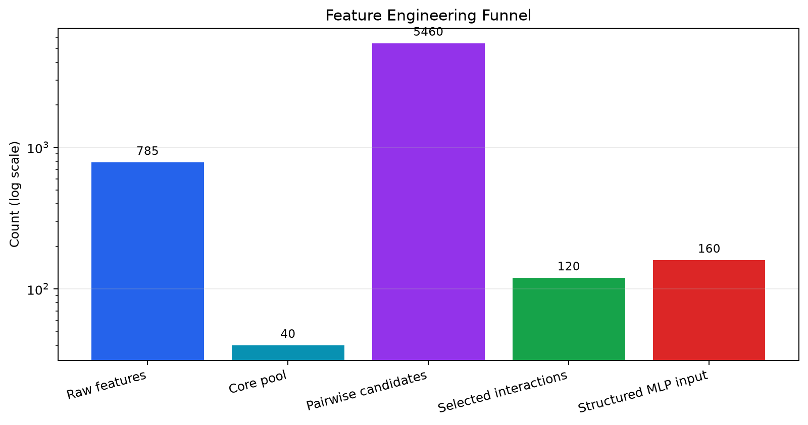

<p align="center">图 1 特征工程漏斗</p>

[图 1](#fig-01) 展示了主任务中的特征空间变化：原始 785 个可用特征先被压缩为 40 个核心特征，再生成 5460 个二阶 interaction 候选，最终筛选出 120 个 interaction features，并与 40 个 core features 共同构成 160 维结构化输入。该过程体现了本文的核心建模思路：不是直接扩大模型输入，而是在受控候选空间中构造可解释、可筛选的新特征。

生成的候选 interaction 通过以下 train-only 分数筛选：

1. 与标签的绝对 Pearson correlation；
2. 与标签的抽样 Spearman correlation；
3. 与当前最优模型残差的绝对 Pearson correlation；
4. 候选特征之间的高相关去重。

最终保留 120 个 interaction features，分别训练 Ridge 和 XGBoost，并与当前最优模型进行小权重融合。

<a id="fig-02"></a>

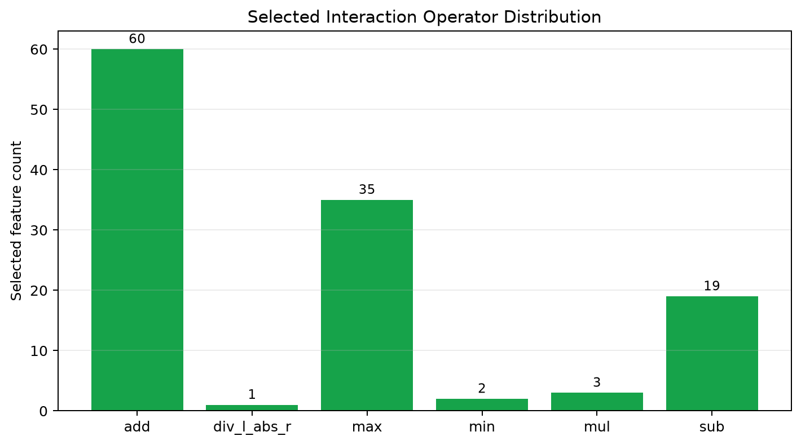

<p align="center">图 2 入选 interaction 操作类型分布</p>

[图 2](#fig-02) 展示了最终 120 个 selected interaction features 的操作类型分布。不同操作类型共同入选，说明有效 interaction 并不只来自单一乘法或比值形式，而是来自多种二阶组合对原始匿名特征的补充表达。

### 5.2 Interaction Ridge 结果

Interaction 分支带来了本文最大的一次结构性提升。

| 分支                           |  Public | Private | 结论      |
| ---------------------------- | ------: | ------: | ------- |
| XGB interaction blend        | 0.05657 | 0.10044 | 基本持平    |
| Ridge interaction-only blend | 0.06362 | 0.10302 | 最大结构性提升 |

结果表明，interaction features 确实补充了原始 top-k 信号。值得注意的是，XGBoost 在 interaction 特征上并不强，真正有效的是 Ridge interaction-only signal。这说明，在经过手工构造的 interaction 空间中，线性模型能够稳定捕捉一部分新的可转移结构，而更复杂的树模型反而容易引入噪声。

### 5.3 交互特征精调与边界

为验证 interaction 分支是否仍有空间，本文进一步进行了 Beta5-B 和 Sprint-A。Beta5-B 将 interaction 数量扩展到 240，并提高 interaction signal 权重；Sprint-A 则用 purged fold-stable scoring 重新筛选 interaction features。

代表性结果如下：

| Candidate                                 |  Public | Private |
| ----------------------------------------- | ------: | ------: |
| 240 interactions, weight 0.20             | 0.06797 | 0.10256 |
| Sprint-A top250_min3_fill120, weight 0.05 | 0.06637 | 0.10514 |
| Sprint-A top250_min4_fill120, weight 0.15 | 0.06766 | 0.10437 |

这些结果说明，interaction 方向确实有效，但简单扩大 interaction 数量或提高权重会更多追逐 public/holdout，而不一定改善 private。最终本文保留 Beta5-A 的 120 interaction Ridge blend 作为主线组件。

---

## 6. 表征学习与神经网络信号

### 6.1 AutoEncoder 表征特征

为了测试低维表征学习是否能进一步提取隐藏结构，本文在 40 个 core features 和 120 个 selected interactions 的 160 维结构化输入上训练 AutoEncoder。模型将输入压缩到 8、16 或 32 维 bottleneck，并尝试了 denoising 和 supervised auxiliary head。

无监督 AE 的结果不理想。虽然部分 AE signal 能提升 holdout/public，但 private 明显下降。

| 分支                           |  Public | Private | 结论         |
| ---------------------------- | ------: | ------: | ---------- |
| AE ridge, weight 0.15        | 0.06488 | 0.10169 | private 下降 |
| AE ridge, weight 0.10        | 0.06454 | 0.10225 | 仍低于当前候选 |
| supervised AE8, weight 0.025 | 0.06454 | 0.10303 | 极小提升       |

后续实验显示，扩大 bottleneck、加入轻度 denoising 或更换 seed 都没有改善 private。将 AE 改为 supervised AE，即在重构输入的同时用 latent representation 辅助预测标准化目标，能产生极弱但可转移的信号。最终 supervised AE8 只以 0.025 的极小权重加入模型。

这说明，AE representation 在当前实现下不能作为主力信号，只能作为非常保守的辅助组件。

### 6.2 Supervised MLP 信号

在 AE 之后，本文进一步训练 supervised MLP。MLP 输入仍为 160 维结构化特征，网络结构包括 `[256,128,64]` 和 `[128,64,32]` 两类隐藏层设置，优化器比较了 SGD 和 AdamW。损失函数为 MSE 与 Pearson loss 的加权组合：

$$
\mathcal{L} =
0.6 \cdot \text{MSE}(y,\hat{y})
+
0.4 \cdot (1-\rho(y,\hat{y}))
$$

其中，

$$
\text{MSE}(y,\hat{y})=
\frac{1}{n}\sum_{i=1}^{n}(y_i-\hat{y}_i)^2
$$

MLP 的定位不是替代当前最优模型，而是生成低权重非线性互补信号。

关键结果如下：

| Candidate                     |  Public | Private | 结论                  |
| ----------------------------- | ------: | ------: | ------------------- |
| AdamW seed mean, weight 0.025 | 0.06588 | 0.10411 | 保守提升                |
| AdamW seed2026, weight 0.075  | 0.06553 | 0.10550 | 开发阶段记录             |
| AdamW seed2026, weight 0.075  | 0.06547 | 0.11043 | 同一冻结文件赛后复核最优观测 |
| AdamW seed3026, weight 0.10   | 0.06930 | 0.10304 | public 高但 private 低 |

后续 Sprint-B 对 AdamW MLP 进行 seed stability 检查，结果显示新 seed 和 seed mean 均未复现 seed2026 的 private 增益。因此，MLP 分支虽然有效，但具有 seed sensitivity。最终模型保留 `wide_adamw_lr001_seed2026` 的 0.075 小权重，而不是使用多 seed 平均。

---

## 7. 最终模型与融合策略

### 7.1 最终模型结构

最终模型不是单一模型，而是由多阶段互补信号逐步叠加得到。其结构可以写成如下递推形式：

$$
\text{beta3} =
0.3825 \cdot \text{top50\_ridge}_{\alpha=200000}
+
0.3825 \cdot \text{top100\_ridge}_{\alpha=50}
+
0.2350 \cdot \text{spearman\_top50\_ridge}
$$

$$
\text{beta4} =
0.75 \cdot \text{beta3}
+
0.25 \cdot \text{shap\_stable\_xgboost}
$$

$$
\text{beta5} =
0.85 \cdot \text{beta4}
+
0.15 \cdot \text{ridge\_interactions\_only}
$$

$$
\text{beta6\_2} =
0.975 \cdot \text{beta5}
+
0.025 \cdot \text{supervised\_ae8\_ridge}
$$

$$
\text{final} =
0.925 \cdot \text{beta6\_2}
+
0.075 \cdot \text{wide\_adamw\_mlp\_seed2026}
$$

<a id="fig-03"></a>

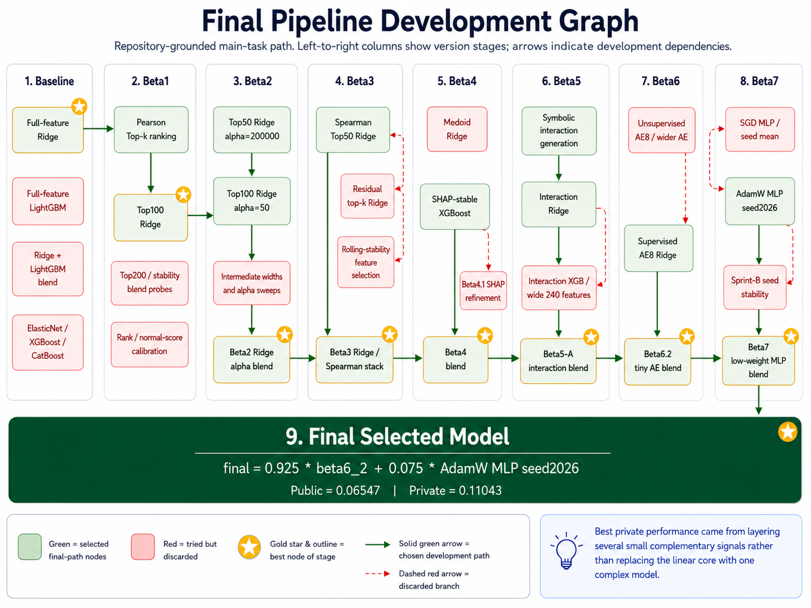

<p align="center">图 3 最终多信号融合结构</p>

[图 3](#fig-03) 总结了最终模型结构。可以看到，最终预测并不是由单一复杂模型给出，而是由 Ridge top-k 主干、SHAP-stable XGBoost、interaction Ridge、supervised AE 和 supervised MLP 按阶段叠加得到。

同一冻结 Beta7 文件在 Kaggle 赛后复核提交中得到如下最佳观测分数：

| 指标              |      分数 |
| --------------- | ------: |
| Public Pearson  | 0.06547 |
| Private Pearson | 0.11043 |

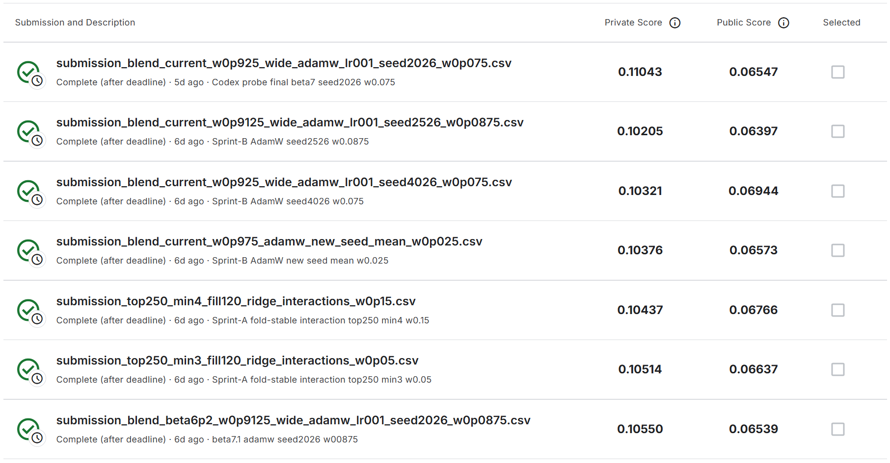

<p align="center">Kaggle 赛后提交记录截图</p>

该分数来自比赛结束后的复核提交，提交文件为 `submissions/01_main/beta7_mlp_signal/submission_blend_current_w0p925_wide_adamw_lr001_seed2026_w0p075.csv`。它与开发阶段冻结的 Beta7 最终公式相同，因此不改变主线模型结构，只更新该文件的最佳观测 leaderboard 分数。由于提交发生在赛后，本文不将其写作官方排名；若按整理的最终榜单分数静态插入，其 private 分数约落在第 6 位，public 分数约落在第 514 位。public 与 private 的明显差异说明，最终模型并非以 public leaderboard 为导向的过度适配结果，而是在 hidden private 分布上具有更好的观测表现。

### 7.2 小权重融合的必要性

本文后期大量实验显示，复杂信号往往存在如下模式：

1. 较大权重能提升 holdout 或 public；
2. private 不一定提升，甚至下降；
3. 小权重互补信号更容易转移到 private。

例如，更大规模 interaction set、较高权重 AE 融合、MLP 0.10 权重以及 Sprint-A/Sprint-B 候选都出现了 public 或 holdout 较好但 private 不如最终候选的现象。因此，最终融合策略不是选择本地最优模型，而是选择已验证的低权重互补信号。

从建模角度看，这一策略相当于将最终预测分解为强主干信号与多个弱补充信号：

$$
\hat{y}_{\text{final}} =
\sum_{m=1}^{M} w_m \hat{y}^{(m)}, \quad
\sum_{m=1}^{M} w_m = 1
$$

其中，$\hat{y}^{(m)}$ 表示不同信号族的预测，$w_m$ 为融合权重。有效的补充信号不需要单独很强，但需要与主模型存在一定差异，并且在 private 上能提供稳定增益。

---

## 8. 实验结果与对比分析

### 8.1 阶段性结果

主任务最终提升过程如下：

| 阶段                      |  Public | Private | 说明                           |
| ----------------------- | ------: | ------: | ---------------------------- |
| Baseline1 stability     | 0.03365 | 0.06628 | 早期稳定性融合基准              |
| Beta1 top100 Ridge      | 0.03716 | 0.08901 | 首个强可转移 top-k Ridge 信号    |
| Beta2 Ridge             | 0.05160 | 0.09638 | 强线性 top-k 基线              |
| Beta3 Spearman          | 0.05456 | 0.10003 | 排序相关性特征筛选               |
| Beta4 SHAP-stable XGB   | 0.05634 | 0.10043 | 树模型稳定特征信号               |
| Beta5 Interaction Ridge | 0.06362 | 0.10302 | 最大结构性提升                  |
| Beta6.2 Supervised AE   | 0.06454 | 0.10303 | 极小表征增益                   |
| Beta7 MLP 开发记录        | 0.06553 | 0.10550 | 开发阶段冻结记录                |
| Beta7 赛后复核           | 0.06547 | 0.11043 | 同一冻结文件赛后最佳观测         |

<a id="fig-04"></a>

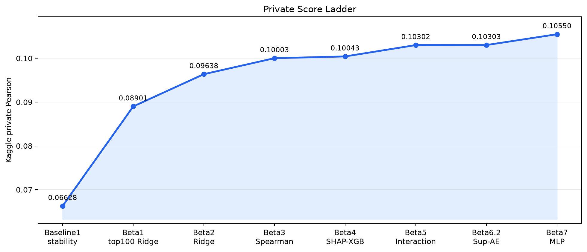

<p align="center">图 4 主任务 private 分数阶梯</p>

[图 4](#fig-04) 展示了 private 分数从 Baseline1、Beta1 到 Beta7 的逐步提升。早期 Baseline1 到 Beta1 的跃迁强调了特征筛选带来的强对比；后续 Beta2 到 Beta7 的提升则说明最终结果来自多类互补信号的持续累积，而不是某一次模型替换带来的偶然提升。赛后复核点使用同一冻结文件，不代表重新开启了一条新的模型路线。

### 8.2 Public/private 分歧

<a id="fig-05"></a>

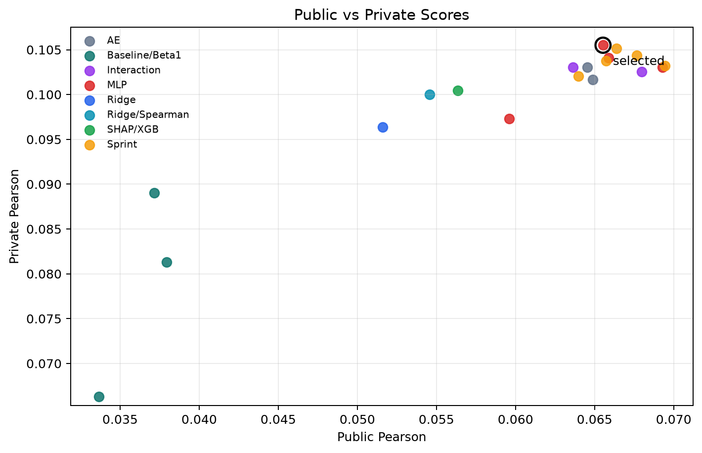

<p align="center">图 5 Public 与 private 分数关系</p>

从 public/private scatter 可以看出，public 分数较高的候选不一定 private 更高。例如，部分高权重 MLP、宽 interaction 和 AE 候选在 public 上表现更强，但 private 明显低于最终候选。这说明 public leaderboard 对模型选择存在误导风险，尤其是在后期模型差异较小、候选高度依赖细微信号时。

因此，本文最终不采用 public 最高的候选，而是选择在 private 已验证、且融合权重较保守的模型结构。

### 8.3 组件相关性与互补性

<a id="fig-06"></a>

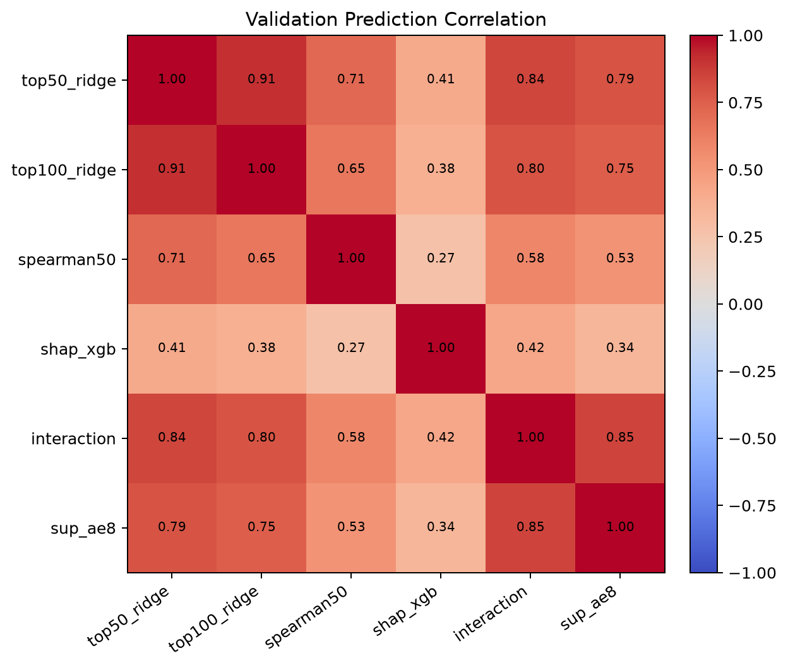

<p align="center">图 6 验证集组件预测相关性</p>

component correlation heatmap 用于观察不同信号族预测之间的相关性。若所有组件高度同质，则 ensemble 很难带来额外收益；若组件差异过大且单体不稳定，也可能引入噪声。本文最终有效组件大多与主模型存在较高但非完全一致的相关性，说明它们并不是完全独立模型，而是主干信号上的结构性修正。

---

## 9. 模型分析与失败实验

### 9.1 成功信号分析

本文最终保留的主要信号包括：

1. Pearson top-k Ridge：提供强线性基线；
2. Spearman top50 Ridge：补充排序关系；
3. SHAP-stable XGBoost：提供树模型稳定特征信号；
4. symbolic interaction Ridge：提供最大结构性增益；
5. supervised AE8：提供极小表征修正；
6. supervised MLP：提供低权重非线性修正。

其中，interaction Ridge 是后期最重要的结构性提升。它说明，在匿名特征缺乏业务语义的情况下，通过统计筛选得到的二阶组合可以构造出新的有效特征空间。

### 9.2 失败方向分析

本文没有回避失败实验。主要失败方向包括：

1. Full LightGBM 不如 Ridge；
2. medoid Ridge 不转移；
3. direct residual blend 不稳定；
4. SHAP-stable 规则微调未超过原始 Beta4-B；
5. 扩大到 240 interaction features 后，public 提升但 private 下降；
6. 无监督 AE 和更宽 AE 表征不转移；
7. MLP seed mean 不如单个 seed2026；
8. 后期 Sprint-A/Sprint-B 均未超过最终候选。

<a id="fig-07"></a>

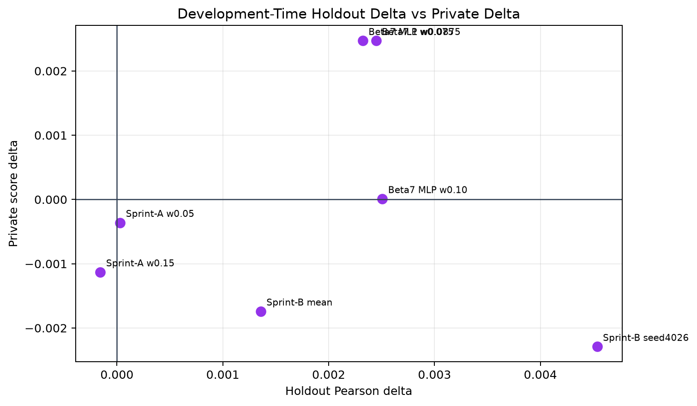

<p align="center">图 7 本地 holdout 提升与 private 提升对比</p>

这些失败实验说明，该任务的模型选择不能只依赖本地 holdout 或 public 分数。许多更复杂、更重的信号会提高局部指标，却降低 hidden private 泛化。

### 9.3 与第一名方案的差距

本文参考了第一名方案中的若干方法级思想，包括 correlation clustering、SHAP-stable feature selection、symbolic interactions、AE features 和 MLP signals。根据第一名公开 writeup 及评论区说明，其核心流程包括：使用 $1-|\rho|$ 作为距离对原始特征聚类，在 threshold 0.6 下得到约 60 个 medoid representatives；再删除与目标几乎无关的特征，保留约 40 个特征；使用 6 组 purged group time series split 和 XGBoost TreeSHAP 选择跨 fold 稳定出现的特征；进一步构造二阶、三阶 symbolic combinations，并进行 feature recycling；最终将特征输入 AutoEncoder 合成 8 个 deep features，并以三层 MLP 作为主要模型 [[3]](#ref-3)。

本文已经复现了上述路线中的主要方法方向，但没有完全复现第一名的最终效果。差距主要体现在以下方面：

1. 第一名方案的 symbolic feature engineering 更深入，除二阶组合外还包含三阶组合和逐个回收被丢弃特征的 feature recycling；
2. 第一名方案中 MLP 是主模型，单模型 private 可达到约 `0.131`，而本文 MLP 只能作为低权重补充信号；
3. 第一名方案中 AE features 是重要增益来源，而本文 AE features 没有形成独立强表征；
4. 第一名本地 CV 虽然整体高于 leaderboard，但候选提升与 public leaderboard 的相关性较稳定；本文后期本地验证、public 分数和 private 分数之间存在更明显错位；
5. 第一名方案在特征筛选、组合生成、表征学习和验证反馈之间形成了更深的迭代闭环，而本文的迭代深度有限。

因此，本文的主要贡献不是完全复现第一名，而是在有限时间内构建了一条可复现、可解释、可分析的建模路线，并系统验证了哪些信号能够转移到 private，哪些方向只是局部验证或 public 指标上的泛化不稳定方向。

---

## 10. 扩展任务 1：高维匿名特征的筛选与降维分析

### 10.1 问题定义与边界

扩展任务 1 回答的问题是：在大量匿名、高相关、可能冗余的特征存在时，如何通过特征筛选或降维，在减少维度和保持预测能力之间取得平衡。

本扩展任务不参与最终 Kaggle 模型选择，也不替换第 7 节中的冻结 Beta7 最终文件。这里的目标是分析高维匿名特征空间的冗余结构，并比较不同压缩策略在特征数量、holdout Pearson、RMSE、训练成本和解释性之间的权衡。所有筛选、PCA、聚类、ElasticNet、LightGBM importance 和 SHAP ranking 均只在 chronological outer train split 上拟合；outer holdout 仅用于最终评估。

### 10.2 匿名特征冗余结构

在 outer train split 上，本文计算了 785 个原始数值特征之间的绝对 Pearson correlation。共有 `307720` 个特征对，绝对相关系数均值为 `0.122248`，中位数为 `0.061925`，但尾部相关性很强：95% 分位数达到 `0.448159`，99% 分位数达到 `0.733853`。其中，绝对相关系数不低于 `0.7` 的特征对有 `3785` 对，不低于 `0.9` 的有 `1071` 对，不低于 `0.95` 的仍有 `425` 对。

<a id="fig-08"></a>

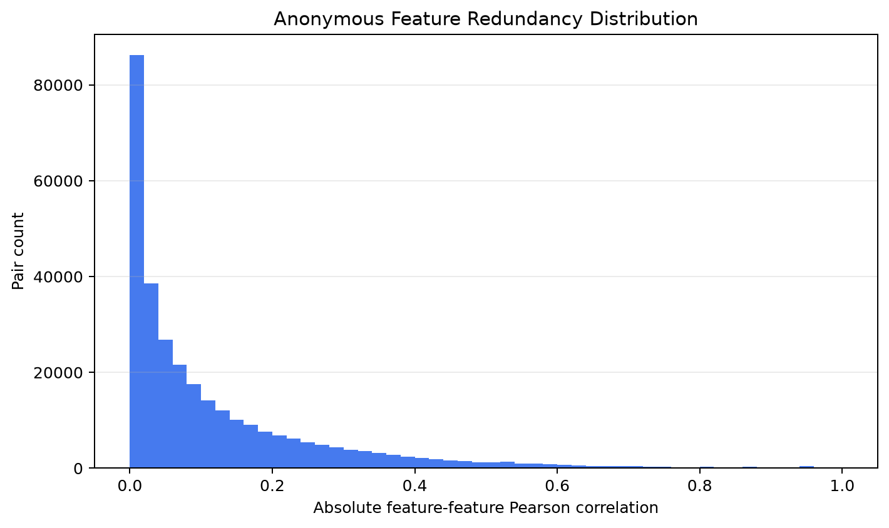

<p align="center">图 8 匿名特征相关性分布</p>

该结果说明，虽然多数特征对相关性较低，但存在大量高度冗余的局部特征簇。若直接使用全部特征，模型需要同时处理弱信号、噪声和冗余变量；若压缩过强，又可能丢失与目标相关的少量有效信号。因此，扩展任务 1 的核心不是简单追求最低维度，而是寻找压缩率和预测保持能力之间的折中。

<a id="fig-09"></a>

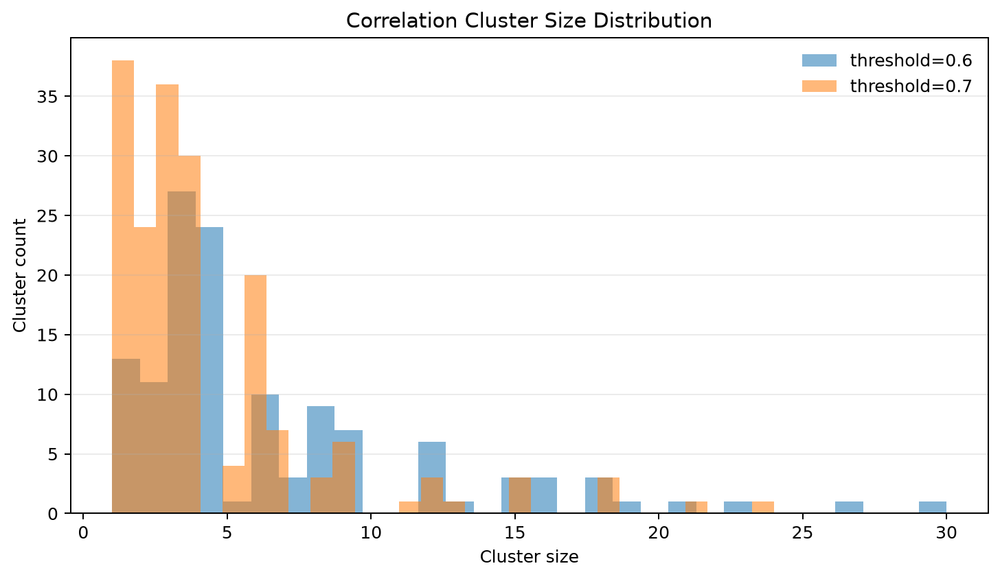

<p align="center">图 9 相关性聚类的簇大小分布</p>

### 10.3 筛选与降维实验

本文比较了 full features、Pearson top-k、Spearman top-k、PCA、相关性聚类代表特征、相关性聚类簇均值、ElasticNet、LightGBM importance top-k 和 SHAP top-k。除 ElasticNet 直接使用自身模型评估外，其余特征方案均使用 Ridge alpha search 在同一 outer holdout 上评估。

各方法的最佳结果如下：

| 方法 | 最佳方案 | 维度 | Holdout Pearson | RMSE |
| --- | --- | ---: | ---: | ---: |
| Pearson top-k | top200 | 200 | 0.124899 | 1.081521 |
| Spearman top-k | top50 | 50 | 0.103647 | 1.051488 |
| Full features | all features | 785 | 0.097166 | 1.235401 |
| 相关性聚类代表特征 | threshold 0.6 | 125 | 0.097382 | 1.105280 |
| 相关性聚类簇均值 | threshold 0.6 | 126 | 0.091806 | 1.115458 |
| SHAP top-k | top300 | 300 | 0.090262 | 1.184801 |
| ElasticNet | full features | 785 | 0.088555 | 1.178551 |
| LightGBM importance top-k | top200 | 200 | 0.086887 | 1.136761 |
| PCA | 200 components | 200 | 0.085799 | 1.110787 |

<a id="fig-10"></a>

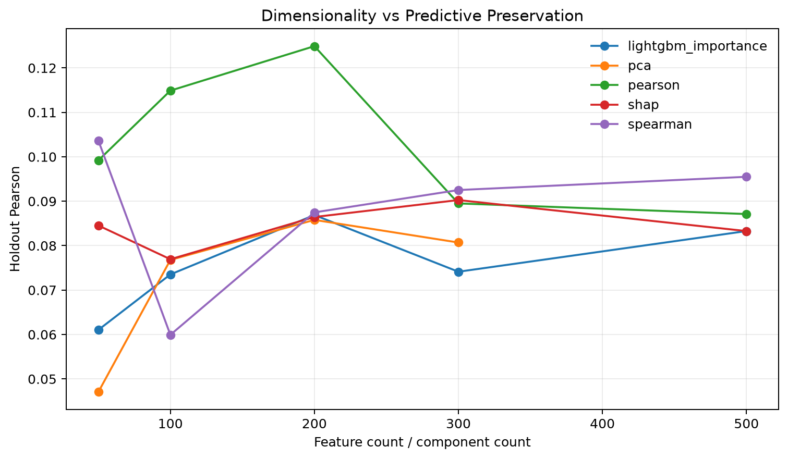

<p align="center">图 10 维度数量与 holdout Pearson 的关系</p>

结果显示，Pearson top200 在本实验中取得最高 holdout Pearson，明显高于 full-feature Ridge。这说明原始 785 个特征中确实存在较多冗余和噪声，监督式相关性筛选可以提升线性模型的有效信噪比。Spearman top50 只保留 50 个特征，Pearson 仍超过 full features，也说明排序相关性能够捕捉一部分与 Pearson 不完全相同的信号。

PCA 在 200 个主成分下已保留约 `97.64%` 的训练特征方差信息，但 holdout Pearson 仅为 `0.085799`，低于 Pearson top-k 和 full features。这说明，无监督方差压缩并不一定保留目标相关信号；在弱信号金融预测中，“方差最大”的方向未必就是“预测最有用”的方向。

<a id="fig-11"></a>

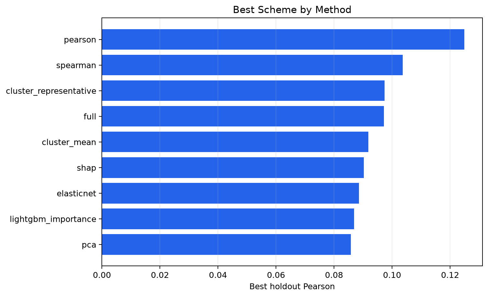

<p align="center">图 11 各方法最佳 holdout Pearson 对比</p>

### 10.4 模型驱动筛选对比

为比较模型驱动筛选与简单相关性筛选，本文在 outer train 内部再次划分 inner train/inner validation，训练 full-feature LightGBM，并基于 gain importance 和 TreeSHAP mean absolute value 得到两组特征排名。随后只使用这些排名产生 top-k 特征集，再回到统一的 Ridge outer-holdout 评估口径。

LightGBM importance 的最佳结果为 top200，holdout Pearson 为 `0.086887`；SHAP ranking 的最佳结果为 top300，holdout Pearson 为 `0.090262`。二者都低于 Pearson top200 的 `0.124899`。这并不说明 LightGBM 或 SHAP 没有价值，而是说明在本任务的简单特征筛选层面，树模型重要性排名更容易捕捉 inner split 的局部非线性结构，不一定比 train-only target correlation 更适合作为 Ridge 的基础输入。

<a id="fig-12"></a>

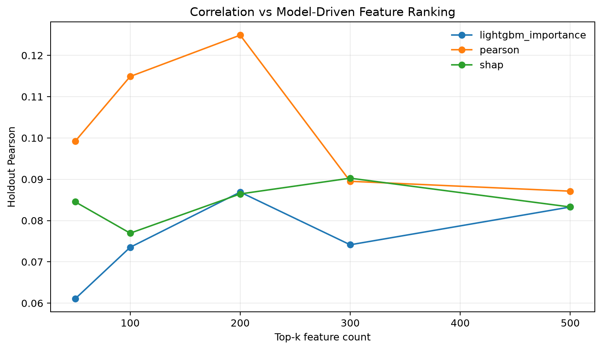

<p align="center">图 12 相关性筛选与模型驱动筛选的 top-k 对比</p>

### 10.5 压缩率与预测能力权衡

从压缩率角度看，Pearson top200 将特征数量从 785 降到 200，压缩约 74.5%，同时 holdout Pearson 从 full-feature Ridge 的 `0.097166` 提升到 `0.124899`。相关性聚类代表特征在 threshold 0.6 下只保留 125 个代表特征，Pearson 为 `0.097382`，与 full-feature Ridge 基本相当，但 RMSE 明显低于 full-feature Ridge。这说明去冗余可以显著压缩输入空间，但未必能最大化 Pearson。

<a id="fig-13"></a>

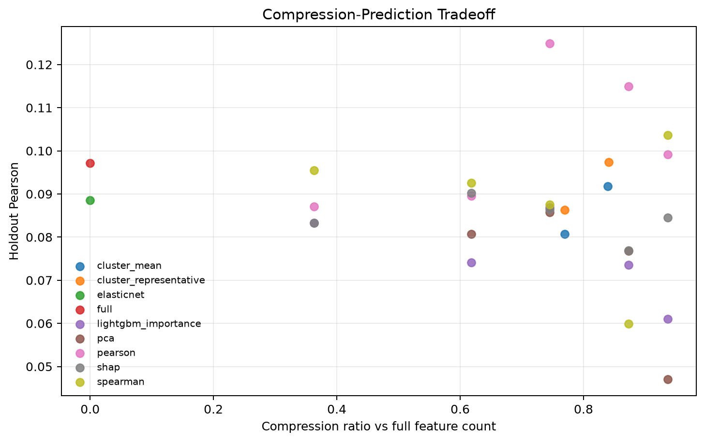

<p align="center">图 13 特征压缩率与预测能力权衡</p>

对主任务的启示是：高维匿名特征不能简单全部输入模型，监督式筛选能显著改善 Ridge 的有效信号质量；PCA、聚类、ElasticNet、LightGBM importance 和 SHAP 各自提供了不同视角，但它们更适合作为结构分析和辅助筛选工具，而不是直接替代最终多信号融合模型。最终主任务采用 top-k 线性主干、结构化 interaction 和小权重非线性补充，正是因为特征压缩、冗余控制和预测保持之间存在这种权衡。

---

## 11. 扩展任务 2：时间稳定性与分布漂移分析

### 11.1 Rolling validation 设计与结果

为检验模型在不同时间段上的稳定性，本文在主线建模之外构造了 expanding rolling validation。每个 fold 使用从样本开头开始的连续训练段，并在后续相邻时间段上验证：

| Fold | 训练区间 | 验证区间 |
| --- | --- | --- |
| `fold_50_60` | 0%-50% | 50%-60% |
| `fold_60_70` | 0%-60% | 60%-70% |
| `fold_70_80` | 0%-70% | 70%-80% |
| `fold_80_90` | 0%-80% | 80%-90% |

每个 fold 内重新进行 train-only Pearson 特征排序、缺失值填充、标准化、Ridge/LightGBM 训练和 Ridge-LightGBM 融合。该设计避免了随机 K-fold 可能引入的时间泄露，也能观察模型表现是否随 row-order time segment 改变。

Rolling validation 的 Ridge-LightGBM ensemble 汇总如下：

| Scheme | Mean Pearson | Std | Min | Max | Mean RMSE |
| --- | ---: | ---: | ---: | ---: | ---: |
| top300 | 0.162315 | 0.051951 | 0.103448 | 0.239494 | 1.023193 |
| top200 | 0.153862 | 0.073044 | 0.081128 | 0.272860 | 1.025452 |
| top500 | 0.139575 | 0.036829 | 0.090258 | 0.175179 | 1.044568 |
| top100 | 0.135306 | 0.058504 | 0.079048 | 0.233110 | 1.025695 |
| top50 | 0.121328 | 0.035865 | 0.078946 | 0.170520 | 1.032792 |
| full | 0.115468 | 0.019837 | 0.098538 | 0.147126 | 1.056822 |

<a id="fig-14"></a>

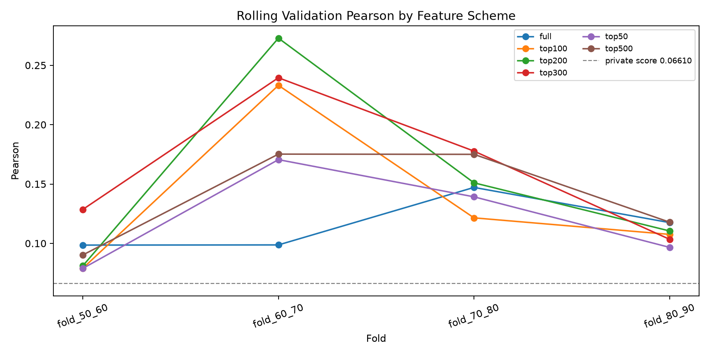

<p align="center">图 14 Rolling validation 中不同特征方案的 Pearson 波动</p>

[图 14](#fig-14) 和表格说明，top300 的平均 rolling Pearson 最高，但 top200/top300 也有明显 fold-to-fold 波动；full feature 方案平均分最低，但标准差最小。也就是说，最高 rolling mean 并不等于最稳健模型。本文后续采用小权重融合，而不是简单选择 rolling mean 最高的分支，正是因为后期模型排序在不同验证口径下并不稳定。

### 11.2 目标分布漂移

各验证时间段的目标分布如下：

| Fold | Target mean | Target std | q05 | Median | q95 |
| --- | ---: | ---: | ---: | ---: | ---: |
| `fold_50_60` | 0.023199 | 0.945710 | -1.305820 | 0.013257 | 1.327380 |
| `fold_60_70` | 0.117703 | 1.044563 | -1.229271 | 0.059195 | 1.611012 |
| `fold_70_80` | 0.054910 | 1.003248 | -1.476842 | 0.042353 | 1.649716 |
| `fold_80_90` | -0.002802 | 1.029727 | -1.430521 | -0.002125 | 1.490496 |

<a id="fig-15"></a>

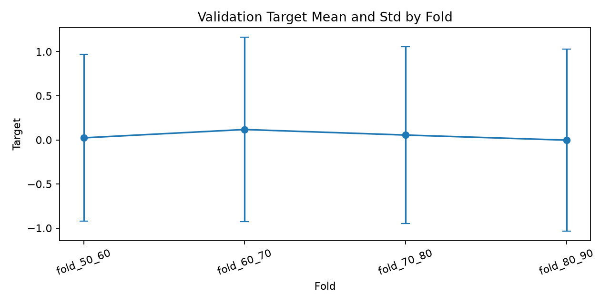

<p align="center">图 15 不同验证时间段的目标均值与标准差</p>

`fold_60_70` 的目标均值和上分位数明显抬升，而 `fold_80_90` 的均值回落到接近 0。这说明目标变量本身随时间段变化，数据不能被简单看作同分布随机样本。由于原始数据没有提供可直接解释的真实时间戳，本文只将其表述为 row-order time segment 上的 distribution drift 或 regime-like shift，不声称已经识别具体市场状态。

### 11.3 特征选择稳定性与特征漂移

不同 rolling folds 中 top-k 特征集存在一定重叠，但并非完全一致：

| Scheme | Mean Jaccard | Min Jaccard | Mean overlap ratio | Min overlap ratio |
| --- | ---: | ---: | ---: | ---: |
| top50 | 0.628933 | 0.492537 | 0.766667 | 0.660000 |
| top100 | 0.675493 | 0.587302 | 0.803333 | 0.740000 |
| top200 | 0.725838 | 0.652893 | 0.839167 | 0.790000 |
| top300 | 0.746621 | 0.690141 | 0.853889 | 0.816667 |
| top500 | 0.770395 | 0.703578 | 0.869333 | 0.826000 |

<a id="fig-16"></a>

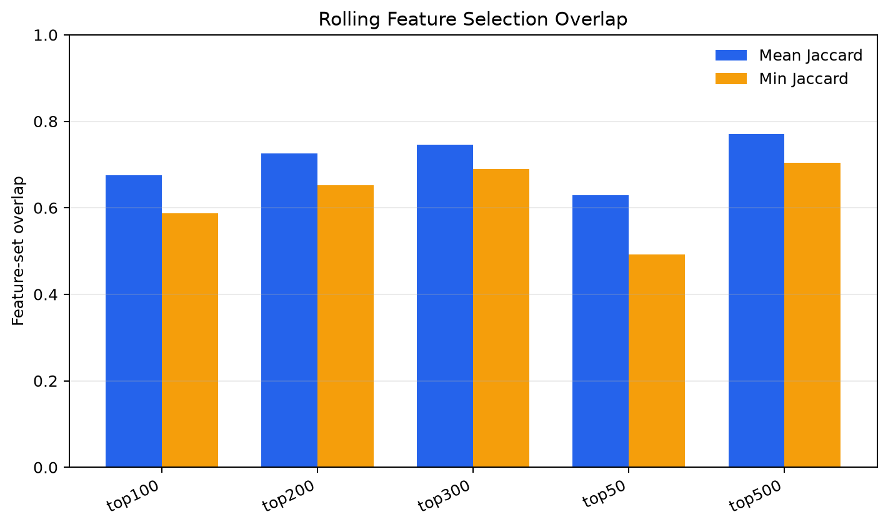

<p align="center">图 16 Rolling folds 间特征选择重叠度</p>

top100 中有 63 个特征在 4 个 folds 中都被选中，说明可用信号并非完全随机。但 top100 的最小 Jaccard 只有 0.587302，top50 的最小 Jaccard 进一步降到 0.492537，说明特征重要性仍会随训练时间段变化。

本文进一步选取 top100 中跨 4 个 folds 出现、平均排名最高的 10 个稳定特征，计算其在各验证段相对 0%-50% 参考训练段的均值漂移：

$$
z_{\text{mean}} =
\frac{\mu_{\text{segment}}-\mu_{\text{reference}}}{\sigma_{\text{reference}}}
$$

<a id="fig-17"></a>

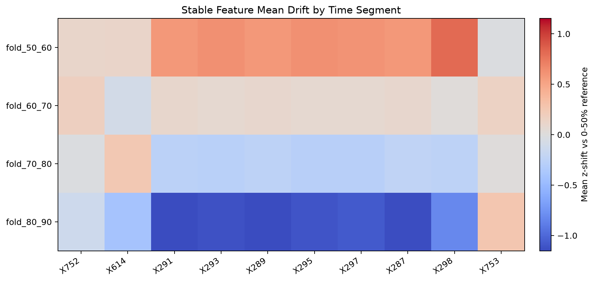

<p align="center">图 17 稳定特征在不同时间段的均值漂移</p>

[图 17](#fig-17) 显示，即使是跨 fold 稳定入选的特征，也存在最高约 1.15 个参考标准差的均值偏移。这类特征分布变化会影响 Pearson 排名、模型系数和树模型分裂行为，从而解释为什么同一模型结构在不同时间段上的表现会产生波动。

### 11.4 Embargo 对照

为检查相邻样本是否导致过于乐观的验证估计，本文增加了一个轻量 embargo 对照。该实验只使用固定 $\alpha=1000$ 的 Ridge top50/top100/top300，不进行 LightGBM 网格或新的模型选择。对比设置为：

1. `gap=0`：普通 chronological 80/20；
2. `gap=1% rows`：训练集末端与验证集开头之间剔除 5258 行作为 embargo。

结果如下：

| Scheme | Gap | Pearson | RMSE | Delta vs gap=0 |
| --- | ---: | ---: | ---: | ---: |
| top50 | 0.00 | 0.099189 | 1.064541 | 0.000000 |
| top50 | 0.01 | 0.115455 | 1.063095 | 0.016266 |
| top100 | 0.00 | 0.114887 | 1.071233 | 0.000000 |
| top100 | 0.01 | 0.113566 | 1.068080 | -0.001322 |
| top300 | 0.00 | 0.089505 | 1.151837 | 0.000000 |
| top300 | 0.01 | 0.092602 | 1.142794 | 0.003097 |

<a id="fig-18"></a>

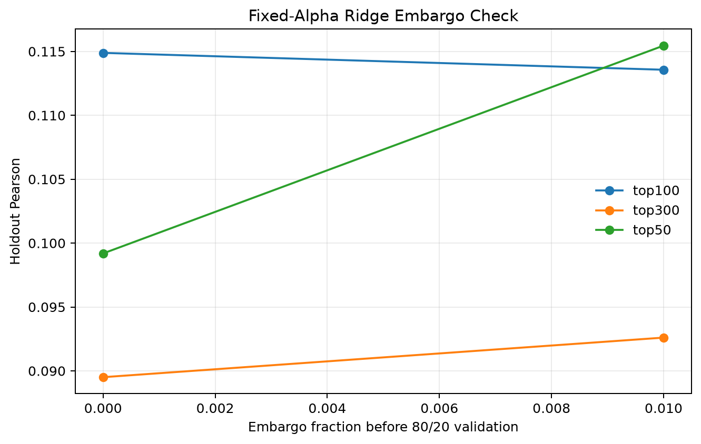

<p align="center">图 18 固定 alpha Ridge 的 embargo 对照</p>

Embargo 后 top100 略降，但 top50 和 top300 反而上升。因此，当前证据不支持把验证不稳定简单归因于相邻时间样本泄露。更合理的解释是：不同 row-order segment 的目标分布、特征分布和有效信号强度同时发生变化，导致验证分数随时间段改变。

### 11.5 Public/private 分歧的解释

主线实验中，public 和 private 分数出现了明显错位。整理 21 个代表性提交后，public/private 分数相关系数约为 0.679，说明二者不是完全无关，但也远非可靠的一一对应。以赛后复核的同一冻结 Beta7 最终文件为参照，有 8 个候选的 public 高于最终文件但 private 低于最终文件。

| Candidate | Public | Private | Public rank | Private rank |
| --- | ---: | ---: | ---: | ---: |
| Sprint-B seed4026 | 0.06944 | 0.10321 | 1 | 7 |
| Beta7 MLP 高权重候选 | 0.06930 | 0.10304 | 2 | 8 |
| Beta5B int240 | 0.06797 | 0.10256 | 3 | 11 |
| Sprint-A w0.15 | 0.06766 | 0.10437 | 4 | 4 |
| Sprint-A w0.05 | 0.06637 | 0.10514 | 5 | 3 |
| Beta7 MLP mean | 0.06588 | 0.10411 | 6 | 5 |
| Sprint-B mean | 0.06573 | 0.10376 | 7 | 6 |
| Beta7 MLP 开发记录 | 0.06553 | 0.10550 | 8 | 2 |

<a id="fig-19"></a>

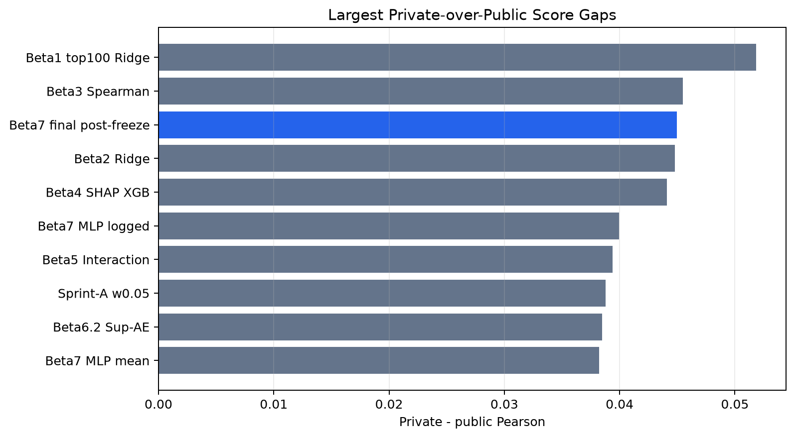

<p align="center">图 19 Private 相对 public 分数差较大的提交</p>

进一步地，本文使用整理后的最终 leaderboard 数据检查全体队伍的 public/private 关系。该表包含 1091 个队伍；剔除 4 行 `publicScore=-1/privateScore=-1` 的异常分数记录后，有效分数行为 1087 行，public/private 分数相关系数为 0.786；public/private 排名相关系数为 0.771。也就是说，分数整体仍同向，但排序会出现明显重排。public 前 20 名队伍的平均 private rank 为 228.85，其中 13 个队伍的 private rank 低于第 100 名；private 第一名的 public rank 为第 37 名。该结果支持“public 分数不能直接代表 private 泛化”的判断，但不等价于证明 public split 或 private split 对应某个具体市场阶段。

<a id="fig-20"></a>

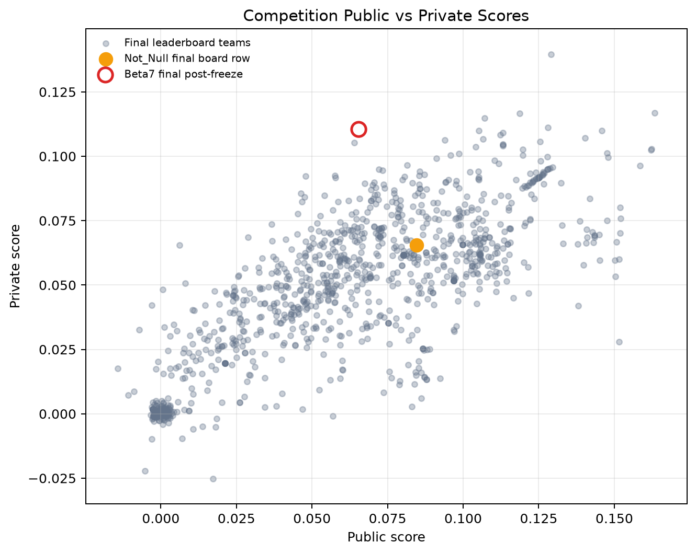

<p align="center">图 20 最终榜单 public/private 分数关系</p>

[图 20](#fig-20) 中，`Not_Null` 是最终榜单中的公开行，public/private 为 `0.08451/0.06553`，提交次数为 12。赛后复核的 Beta7 最终文件 public/private 为 `0.06547/0.11043`，不在官方最终排名中；若按分数静态插入整理后的榜单，其 public 约第 514，private 约第 6。这个对照不能写作官方排名，但能说明同一模型在两个隐藏 split 上可能呈现完全不同的相对位置。

<a id="fig-21"></a>

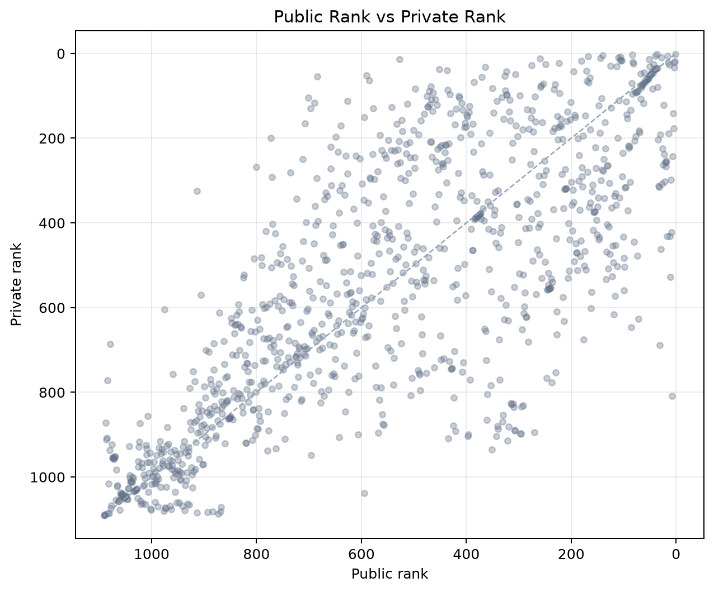

<p align="center">图 21 最终榜单 public/private 排名关系</p>

这种现象可以从三个层面解释。第一，Kaggle public 和 private 是两个不同隐藏 split；若两个 split 对应不同时间段或不同分布，则 public 排名和 private 排名自然可能不一致。第二，public leaderboard 可被多次提交间接适配，后期候选容易奖励 public-specific 的细微信号；本项目通过 Kaggle CLI 可见赛后提交记录共 50 次，而最终榜单中的 `Not_Null` 行只对应赛前/赛中记录的 12 次提交。第三，本文中高权重 MLP、宽 interaction、高权重 AE 等候选多次出现 public 或 holdout 提升但 private 下降，说明更强、更重的局部信号可能只适合某个测试子分布，而不一定适合 private split。

因此，本文不把 public 高低作为最终模型选择的唯一依据。最终模型 public 分数并不突出，但 private 分数最高，说明它更可能贴合 private split 的隐藏分布。需要强调的是，这只是基于提交结果和时间段验证模式作出的 split-level distribution mismatch 推断，不能据此把 public split 或 private split 直接绑定到某一段外部行情。

对主任务的启示是：时间段验证和 public/private 分歧共同说明，后期模型选择不能只依赖单一验证口径。因此，本文在最终模型中采用多类弱互补信号的小权重融合，并保留失败实验分析，以降低对某一个局部 split 的过度适配风险。

---

## 12. 扩展任务 3：预测信号解释

### 12.1 重构验证预测与分析口径

扩展任务 3 的目标是把最终预测值解释为可理解的排序信号，而不是重新选择模型。分析对象仍为冻结 Beta7 公式：

```text
final = 0.925 * beta6_2_current_best + 0.075 * wide_adamw_lr001_seed2026
```

由于已有 `wide_adamw_lr001_seed2026` 验证预测文件不是完整 80/20 holdout 长度，本文只重训该单一 MLP 分支，并按 Beta7.1 的配置重构 105178 行 chronological holdout 预测。重构检查如下：

| 项目 | 数值 |
| --- | ---: |
| Holdout 样本数 | 105178 |
| 全局样本起点 | 420708 |
| 全局样本终点 | 525885 |
| Beta6.2 holdout Pearson | 0.119194 |
| MLP signal holdout Pearson | 0.089807 |
| Final holdout Pearson | 0.121517 |
| 历史 Beta7 w0.075 holdout Pearson | 0.121517 |

重构结果与历史记录一致，说明后续解释使用的是最终冻结公式对应的验证集预测。该分析只使用 holdout 标签进行事后解释，不参与训练、调参或模型选择。

### 12.2 高中低预测组解释

将 holdout 样本按最终预测值从低到高排序，定义 bottom 10%、middle 80% 和 top 10% 三组。三组的平均预测值和平均真实目标如下：

| Signal group | 样本数 | 平均预测值 | 平均真实目标 |
| --- | ---: | ---: | ---: |
| bottom 10% | 10518 | -0.446904 | -0.129457 |
| middle 80% | 84143 | -0.057816 | 0.076691 |
| top 10% | 10517 | 0.380940 | 0.296690 |

<a id="fig-22"></a>

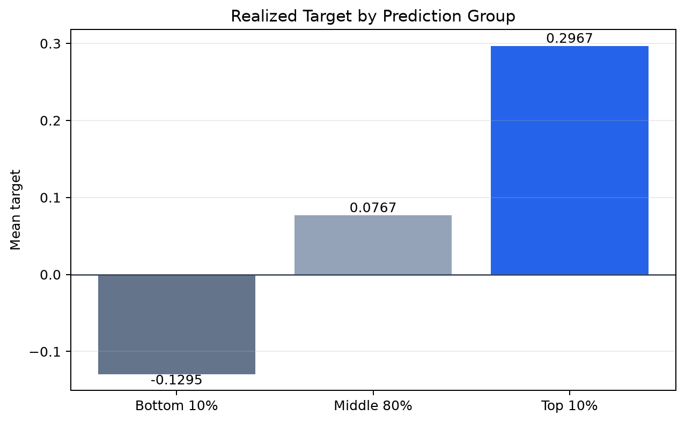

<p align="center">图 22 不同预测强度组的平均真实目标</p>

结果显示，最高预测组的平均真实目标显著高于最低预测组，top-minus-bottom target spread 为 `0.426147`。这说明最终预测值虽然无法精确预测单个样本，但在样本排序层面确实包含有效信息。

### 12.3 十分位排序曲线

进一步将预测值划分为 10 个 deciles，计算每个 decile 的平均真实目标。最低两个 deciles 的平均目标为负，随后随预测分位整体上升，最高 decile 的平均目标达到 `0.296690`。

<a id="fig-23"></a>

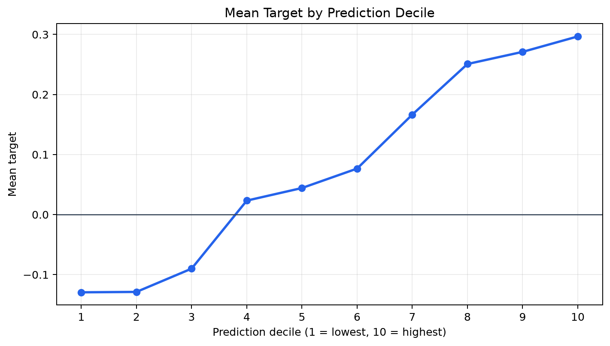

<p align="center">图 23 不同预测 decile 的平均真实目标</p>

最终预测与真实目标的 Pearson correlation 为 `0.121517`，Spearman rank correlation 为 `0.135729`。Spearman 为正且 decile 曲线整体抬升，说明官方 Pearson 分数背后也对应一定排序能力。换言之，模型输出不是只在数值相关性上有效，也能把样本大致分成更高目标和更低目标的群体。

### 12.4 方向一致性与理论 top-bottom 诊断

本文进一步计算预测值符号与真实目标符号是否一致。整体 sign agreement 为 `53.41%`，top/bottom 10% 强信号组为 `55.56%`，高于中间 80% 的 `52.87%`。

<a id="fig-24"></a>

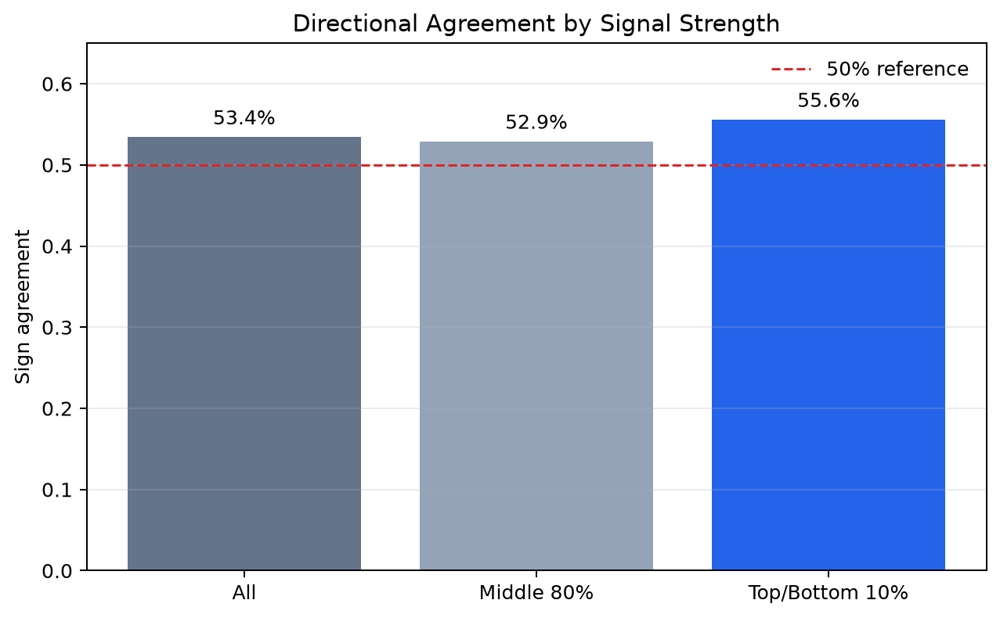

<p align="center">图 24 不同信号强度下的方向一致率</p>

方向一致率只用于解释预测信号的方向含义，不等同于可执行策略效果。特别是，本任务没有建模交易成本、滑点、延迟、仓位约束、换手率或风险控制，因此不能把该指标解释为投资表现。

<a id="fig-25"></a>

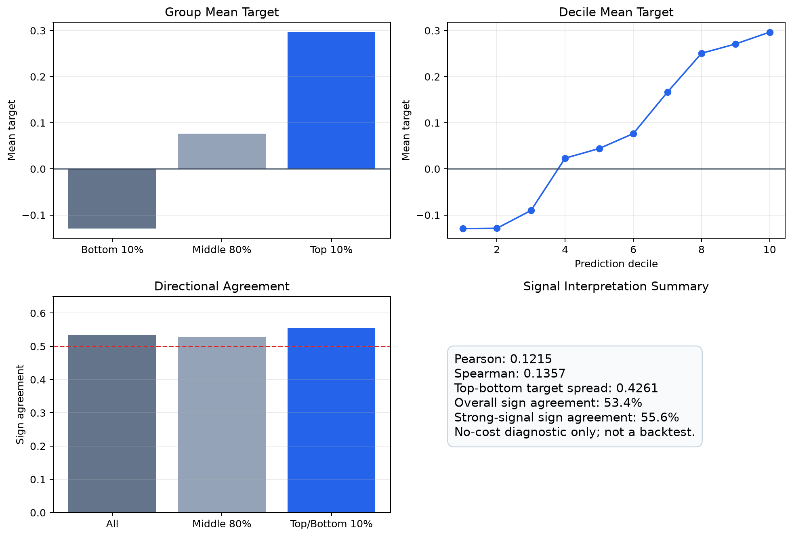

<p align="center">图 25 预测信号解释汇总</p>

作为无交易成本诊断，若把 top 10% 看作理论高预测组、bottom 10% 看作理论低预测组，两组平均目标差为 `0.426147`。该数值只说明预测排序和目标均值之间存在差异，不构成任何可执行交易结论。

对主任务的启示是：最终预测值不仅在 Pearson correlation 指标上为正，也能在 holdout 样本排序层面区分较高目标和较低目标群体。这为模型输出提供了直观解释，但仍不能替代真实交易回测。

---

## 13. 总结

本文围绕 Kaggle DRW Crypto Market Prediction 主任务，构建了一个从强线性基线到多信号融合的完整预测系统。实验表明，在高维匿名金融特征场景下，Ridge 等简单线性模型在经过严格特征筛选后非常强；复杂模型并不能直接替代线性模型，而应作为低权重互补信号加入。

本文的主要发现包括：

1. Pearson/Spearman top-k Ridge 是稳定强基线；
2. 高维匿名特征存在明显冗余，Pearson top200 在压缩约 74.5% 特征后仍优于 full-feature Ridge；
3. SHAP-stable XGBoost 可提供小幅树模型补充；
4. symbolic interaction features 是最大的结构性增益来源；
5. AutoEncoder 表征在当前实现下效果有限，仅 supervised AE8 有极小收益；
6. supervised MLP 可提供非线性补充，但存在 seed sensitivity；
7. public/private divergence 明显，模型选择不能只追 public 或 holdout；
8. 时间稳定性和分布漂移解释了验证分数随 row-order segment 改变的现象；
9. 最终预测值具备可解释的排序含义，高预测组平均真实目标明显高于低预测组；
10. 最终有效策略是多类互补信号的小权重保守融合。

<a id="fig-26"></a>

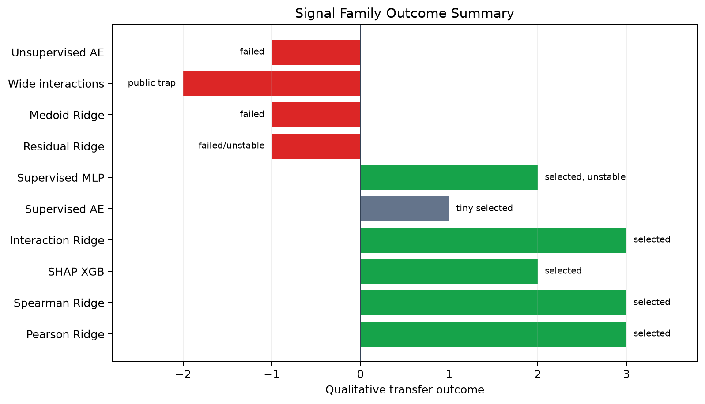

<p align="center">图 26 不同信号族的转移效果总结</p>

**最终冻结 Beta7 文件的最佳观测 private 分数为 0.11043。** 该结果来自赛后复核提交，因此本文不声称官方排名；若按整理后的最终榜单分数静态插入，private 约落在第 6 位。该结果说明，本文方法虽然未完全复现第一名方案，但已经在隐藏测试集上表现出较强泛化能力。后续若继续扩展，可重点研究更系统的特征回收、更复杂但可控的符号特征构造，以及更稳定的监督式表征学习。

---

## 参考文献

<span id="ref-1">[1]</span> Kaggle. DRW Crypto Market Prediction[EB/OL]. Kaggle Competition, 2025. https://www.kaggle.com/competitions/drw-crypto-market-prediction

<span id="ref-2">[2]</span> Kaggle. DRW Crypto Market Prediction: Evaluation[EB/OL]. Kaggle Competition, 2025. https://www.kaggle.com/competitions/drw-crypto-market-prediction/overview/evaluation

<span id="ref-3">[3]</span> Kaggle. DRW solution 1st[EB/OL]. Kaggle Competition Writeup, 2025. https://www.kaggle.com/competitions/drw-crypto-market-prediction/writeups/drw-solution-1st

<span id="ref-4">[4]</span> Hoerl A E, Kennard R W. Ridge regression: biased estimation for nonorthogonal problems[J]. Technometrics, 1970, 12(1): 55-67.

<span id="ref-5">[5]</span> Zou H, Hastie T. Regularization and variable selection via the elastic net[J]. Journal of the Royal Statistical Society: Series B, 2005, 67(2): 301-320.

<span id="ref-6">[6]</span> Chen T, Guestrin C. XGBoost: A scalable tree boosting system[C]//Proceedings of the 22nd ACM SIGKDD International Conference on Knowledge Discovery and Data Mining. New York: ACM, 2016: 785-794.

<span id="ref-7">[7]</span> Ke G, Meng Q, Finley T, Wang T, Chen W, Ma W, Ye Q, Liu T Y. LightGBM: A highly efficient gradient boosting decision tree[C]//Advances in Neural Information Processing Systems. 2017, 30: 3146-3154.

<span id="ref-8">[8]</span> Prokhorenkova L, Gusev G, Vorobev A, Dorogush A V, Gulin A. CatBoost: unbiased boosting with categorical features[C]//Advances in Neural Information Processing Systems. 2018, 31.

<span id="ref-9">[9]</span> Lundberg S M, Lee S I. A unified approach to interpreting model predictions[C]//Advances in Neural Information Processing Systems. 2017, 30.

<span id="ref-10">[10]</span> Pearson K. On lines and planes of closest fit to systems of points in space[J]. Philosophical Magazine, 1901, 2(11): 559-572.

<span id="ref-11">[11]</span> Jolliffe I T. Principal Component Analysis[M]. 2nd ed. New York: Springer, 2002.

<span id="ref-12">[12]</span> Hinton G E, Salakhutdinov R R. Reducing the dimensionality of data with neural networks[J]. Science, 2006, 313(5786): 504-507.

<span id="ref-13">[13]</span> Goodfellow I, Bengio Y, Courville A. Deep Learning[M]. Cambridge: MIT Press, 2016.

<span id="ref-14">[14]</span> López de Prado M. Advances in Financial Machine Learning[M]. Hoboken: Wiley, 2018.

<span id="ref-15">[15]</span> Kaufman R L, Rosset S, Perlich C, Stitelman O. Leakage in data mining: formulation, detection, and avoidance[J]. ACM Transactions on Knowledge Discovery from Data, 2012, 6(4): 1-21.

<span id="ref-16">[16]</span> Bailey D H, Borwein J M, López de Prado M, Zhu Q J. The probability of backtest overfitting[J]. Journal of Computational Finance, 2017, 20(4): 39-69.
